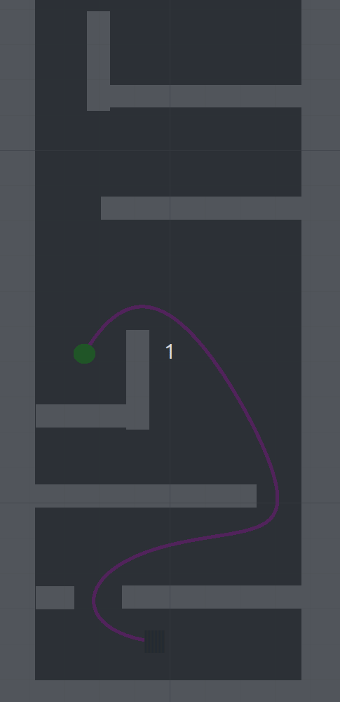

# Unity-OMPL


# run
```
git clone https://github.com/pac48/Unity-OMPL.git
cd Unity-OMPL/planner/
cmake -S . -B build
cd build
make install
```
Then open the project (Unity-OMPL) with the Unity editor. Note: you need to have ros sourced before opening. This is becuase the `LD_LIBRARY_PATH` is modified by ROS and needed for Unity to find the packages.

Then, open the Scenes folder and double click the SampleScene.unity file. Once the scene is opened,  pressthe play button to see path planning in realtime! 

Note: I am using Unity version 2021.3.17f1 on Ubuntu 22.04 with ROS Humble.

<p align="center">
  
</p>
